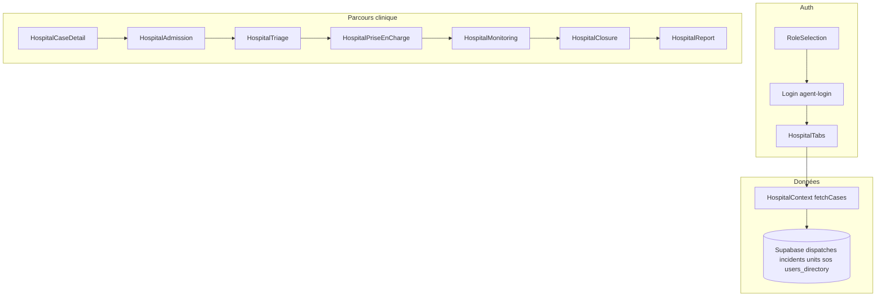

# Audit portail hôpital — État d’intégration mobile vs backend (Lovable)

> **Destinataire :** équipe **Lovable / Supabase** (dashboard, schéma, Edge Functions, Realtime, RLS)  
> **Source :** dépôt mobile **Étoile Bleue Urgentiste** (React Native / Expo)  
> **Date :** avril 2026  
> **Objectif :** lister ce qui est **déjà branché** à Supabase, ce qui est **mocké ou incomplet**, et les **livrables backend** attendus pour un parcours hôpital **bout en bout** jusqu’à l’envoi du rapport à la centrale.

---

## Contexte

L’app hôpital (`role === 'hopital'`) charge les dossiers via [`HospitalContext`](src/contexts/HospitalContext.tsx) et persiste le parcours clinique dans **`dispatches.hospital_data`** (JSON fusionné) + colonnes **`dispatches`** (statut terrain, `hospital_*`, etc.), sous réserve de **RLS** et de la liaison **`health_structures` ↔ `users_directory`**.

---

## Synthèse du flux (référence code)

La navigation globale est définie dans [`App.tsx`](App.tsx) (onglets `HospitalTabs` + écrans stack `Hospital*`).

---

## 1. Déjà intégré (côté mobile — Supabase)

Comportement **réel** tant que la base, les politiques **RLS** et les colonnes attendues sont en place (ex. `assigned_structure_id`, `hospital_data`, publication **Realtime** sur `dispatches`).

| Zone | Fichiers / mécanisme |
|------|----------------------|
| Auth rôle hôpital | [`AuthContext`](src/contexts/AuthContext.tsx) — `RoleSelection` → `LoginPage` (Edge Function `agent-login`) |
| Liste des cas | [`HospitalContext.fetchCases`](src/contexts/HospitalContext.tsx) : `dispatches` filtrés par `assigned_structure_id`, jointures `incidents`, `units` (sélection partielle), agrégation `sos_responses`, profils citoyens via `users_directory` |
| Rafraîchissement temps réel | Canal `postgres_changes` sur la table `dispatches` (filtre structure) dans le même contexte |
| Détail cas / acceptation / refus | [`HospitalCaseDetailScreen`](src/screens/hospital/HospitalCaseDetailScreen.tsx) : `updateCaseStatus` pour `hospital_status` ; suivi carte : `active_rescuers`, repli `units`, `users_directory` par `assigned_unit_id` |
| Admission | [`HospitalAdmissionScreen`](src/screens/hospital/HospitalAdmissionScreen.tsx) : `updateCaseStatus` → `hospital_data.status` = `admis`, `dispatches.status` = `arrived_hospital` |
| Triage | [`HospitalTriageScreen`](src/screens/hospital/HospitalTriageScreen.tsx) : écriture dans `hospital_data` (niveau START, vitaux, symptômes, diagnostic provisoire, `triageRecordedAt`) |
| PEC | [`HospitalPriseEnChargeScreen`](src/screens/hospital/HospitalPriseEnChargeScreen.tsx) : `hospital_data.status` = `prise_en_charge` + `observations`, `exams`, `treatments`, `timeline`, résumés `treatment` / `notes` |
| Monitoring | [`HospitalMonitoringScreen`](src/screens/hospital/HospitalMonitoringScreen.tsx) : `hospital_data.status` = `monitoring` + `monitoringStatus`, `monitoringNotes`, `transferTarget` |
| Clôture | [`HospitalClosureScreen`](src/screens/hospital/HospitalClosureScreen.tsx) : `hospital_data.status` = `termine`, `dispatches.status` = `completed`, `dischargedAt`, etc. |
| Onglet Urgences | [`HospitalDashboardTab`](src/screens/hospital/HospitalDashboardTab.tsx) : liste basée sur **`activeCases`** (données Supabase), pas sur `MOCK_CASES` pour l’affichage principal |
| Liste Admissions | [`HospitalAdmissionsListScreen`](src/screens/hospital/HospitalAdmissionsListScreen.tsx) : `activeCases`, navigation selon le statut (y compris `monitoring`) |
| Profil hôpital | [`HospitalProfileTab`](src/screens/hospital/HospitalProfileTab.tsx) : `useAuth` |

**Documents de contrat déjà alignés avec une partie du flux :**  
[`PROMPT_CURSOR_INTEGRATION_HOSPITAL_DATA.md`](PROMPT_CURSOR_INTEGRATION_HOSPITAL_DATA.md), [`LOVABLE_NOTE_ADMISSION_MODE_ETAT_ORIENTATION.md`](LOVABLE_NOTE_ADMISSION_MODE_ETAT_ORIENTATION.md), [`PROMPT_CURSOR_HOSPITAL_PEC_MONITORING.md`](PROMPT_CURSOR_HOSPITAL_PEC_MONITORING.md).

---

## 2. Non intégré, partiel ou risque de données

Chaque point indique l’**impact** et une **piste** pour Lovable / produit.

| # | Sujet | État actuel (mobile) | Impact | Piste technique / produit |
|---|--------|----------------------|--------|---------------------------|
| 1 | **Envoi du rapport à la centrale** | [`HospitalReportScreen`](src/screens/hospital/HospitalReportScreen.tsx) : `handleSendReport` affiche une **alerte de succès factice** ; aucun appel réseau, aucune persistance, aucun événement côté centrale. | Le rapport final **n’est pas transmis** ni traçable côté backend. | Définir : Edge Function `POST`, insert dans une table `hospital_reports` / `dispatch_id`, notification Realtime ou webhook vers le dashboard ; contrat JSON attendu + retour d’erreur. |
| 2 | **Historique & KPIs** | [`HospitalHistoryScreen`](src/screens/hospital/HospitalHistoryScreen.tsx) utilise **`MOCK_CASES`** ([`HospitalDashboardTab.tsx`](src/screens/hospital/HospitalDashboardTab.tsx)) et des **chiffres statiques** (ex. 128, 8 min, 82 %). | Statistiques et liste **non représentatives** des dossiers réels. | Requêtes sur `dispatches` (`status = completed` / `hospital_data.status = termine`), filtres par `assigned_structure_id`, agrégations (optionnel vues SQL). |
| 3 | **Signalement contraintes** | [`HospitalIssuesScreen`](src/screens/hospital/HospitalIssuesScreen.tsx) : **aucune persistance** ; alerte de confirmation uniquement. | La régulation ne reçoit **pas** les signalements (lits, personnel, etc.). | Table dédiée (ex. `hospital_constraints`) + RLS + éventuellement Edge pour notification ; référence [`LOVABLE_SPEC_PORTAIL_HOPITAL.md`](LOVABLE_SPEC_PORTAIL_HOPITAL.md). |
| 4 | **Chronologie du rapport** | L’écran rapport affiche `caseData.interventions` ; le parcours PEC persiste surtout **`timeline` / `observations` / `treatments`** dans `hospital_data`, pas le tableau **`interventions`** (structuré comme dans les mocks). | Section « Chronologie des interventions » **vide ou incomplète** pour les dossiers réels. | Choisir : (a) mapper `timeline` → affichage rapport, ou (b) remplir `hospital_data.interventions` à la clôture / en fin de PEC ; documenter le schéma unique. |
| 5 | **Paramètres « Plus »** | [`HospitalSettingsScreen`](src/screens/hospital/HospitalSettingsScreen.tsx) : entrées Statistiques, Paramètres, Personnel, Notifications avec **`route: null`**. | Fonctionnalités **non accessibles**. | Hors scope backend pur : décider des écrans ; sinon deep links / placeholders documentés. |
| 6 | **Contact unité (`units.phone`)** | Dans `fetchCases`, le select `units` n’inclut pas explicitement **`phone`** (voir [`HospitalContext.tsx`](src/contexts/HospitalContext.tsx)). | Si la colonne existe en base, le mobile peut ne pas remonter le **téléphone unité** pour appel / SMS. | Ajouter `phone` au `select` si présent en schéma ; aligner avec [`LOVABLE_NOTE_FLUX_HOPITAL.md`](LOVABLE_NOTE_FLUX_HOPITAL.md). |
| 7 | **`triageNotes`** | Mentionnée dans certains prompts backend ([`PROMPT_CURSOR_HOSPITAL_PEC_MONITORING.md`](PROMPT_CURSOR_HOSPITAL_PEC_MONITORING.md)) ; **aucune écriture** dans le code mobile (`src/`). | Dashboard peut attendre une clé **absente** du mobile. | Soit retirer le champ côté dashboard, soit ajouter champ + UI triage si nécessaire. |
| 8 | **Écran alternatif** | [`HospitalUrgencyDetailScreen`](src/screens/hospital/HospitalUrgencyDetailScreen.tsx) : timeline en grande partie **générique / statique**. | Double entrée possible avec le détail incident réel ; risque de confusion. | Fusion avec `HospitalCaseDetail` ou branchement sur les mêmes données `EmergencyCase` / dispatch. |
| 9 | **Notifications push (rôle hôpital)** | [`usePushTokenRegistration`](src/hooks/usePushTokenRegistration.ts) utilisé dans [`App.tsx`](App.tsx) en contexte auth générique. | **À valider** : les campagnes / cibles FCM incluent-elles le rôle `hopital` pour nouvelle alerte ? | Confirmer côté backend (topics, table `device_tokens`, Edge `send-call-push` ou équivalent hôpital). |
| 10 | **Documentation interne** | [`LOVABLE_INTEGRATION_ADMISSION.md`](LOVABLE_INTEGRATION_ADMISSION.md) : tableau des valeurs `hospital_data.status` **sans** `monitoring`. | Dérive doc / intégration pour les partenaires. | Mettre à jour la doc (inclure `monitoring`, `prise_en_charge`, etc. selon le schéma réel). |

---

## 3. Checklist de livrables attendus de Lovable (retour équipe)

Merci de renvoyer un **Markdown** (ou tickets) couvrant au minimum :

1. **Envoi rapport à la centrale** : méthode (Edge Function, table, événement Realtime), payload JSON, codes d’erreur, idempotence.
2. **Historique dossiers clos** : requêtes PostgREST (filtres `assigned_structure_id`, pagination), éventuelles vues / index.
3. **Signalements contraintes** : schéma table + **RLS** + flux jusqu’au dashboard opérateur.
4. **Alignement JSON** : `interventions` vs `timeline` ; `triageNotes` si conservé ; cohérence avec [`hospital_data`](src/contexts/HospitalContext.tsx) après fusion.
5. **Colonnes `units`** : liste exacte exposée au mobile (dont `phone` si applicable).
6. **Push / notifications** : règles par rôle (`hopital` vs urgentiste) et configuration FCM.
7. **Mise à jour des guides** du dépôt si renommage de clés ou nouvelles tables.

---

## Références rapides (fichiers mobile)

| Fichier | Rôle |
|---------|------|
| [`App.tsx`](App.tsx) | Stack + `HospitalProvider` |
| [`src/contexts/HospitalContext.tsx`](src/contexts/HospitalContext.tsx) | `fetchCases`, `updateCaseStatus`, `mapRowToCase`, Realtime |
| [`src/screens/hospital/HospitalReportScreen.tsx`](src/screens/hospital/HospitalReportScreen.tsx) | Rapport final — **envoi non implémenté** |
| [`src/screens/hospital/HospitalHistoryScreen.tsx`](src/screens/hospital/HospitalHistoryScreen.tsx) | Historique — **mock** |

---

*Document généré pour handoff Lovable — à compléter après réponse de l’équipe backend (schéma final, RLS, Edge Functions).*
