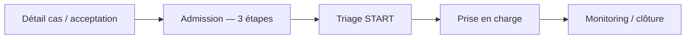

# Intégration — Processus d’admission hôpital (Étoile Bleue)

> **Destinataire :** équipe **Lovable / Supabase** (et toute app cliente : `eb-urgentiste`, `eb-structure`, etc.)  
> **Version :** 1.0 — avril 2026  
> **Backend cible :** Supabase — table `dispatches`, colonne JSON **`hospital_data`**, statut métier **`dispatches.status`**

Ce document décrit **toutes les étapes** du parcours **Admission** tel qu’implémenté dans l’app mobile, afin que les données soient **persistées de façon cohérente** en base et réutilisables par d’autres applications.

---

## 1. Place dans le parcours hôpital



- **Entrée** : depuis `HospitalCaseDetail` (bouton « Patient arrivé » / « Continuer vers l’admission ») avec un `EmergencyCase` dont l’identifiant métier est **`dispatches.id`** (UUID).
- **Sortie** : écran **Triage** (`HospitalTriage`) avec le même dossier enrichi des champs d’admission.

---

## 2. Éléments identifiants côté base

| Concept | Source (mobile) | Supabase |
|--------|------------------|----------|
| Dossier / cas | `EmergencyCase.id` | `dispatches.id` |
| Structure | `health_structure_id` (profil) | `dispatches.assigned_structure_id` = `health_structures.id` |
| Données admission | `hospital_data` (JSON fusionné) | `dispatches.hospital_data` JSONB |

**Important :** `caseId` transmis au flux admission est **`dispatches.id`**, pas `incidents.id`.

---

## 3. Les trois étapes d’admission (UI)

L’écran `HospitalAdmissionScreen` impose **3 étapes séquentielles** ; chaque étape a un choix **obligatoire** avant validation finale.

### Étape 1 — Mode d’arrivée (`arrivalMode`)

Aligné sur le **même vocabulaire** que le mode de transport côté urgentiste (`src/lib/transportMode.ts`).

| Clé JSON | Libellé UI (réf.) |
|----------|-------------------|
| `AMBULANCE` | Ambulance standard |
| `SMUR` | Unité SMUR / Réa |
| `MOTO` | Moto intervention |
| `PERSONNEL` | Transport perso |

**Rétrocompatibilité** (si anciennes données) : `ambulance` → `AMBULANCE`, `transport_prive` → `PERSONNEL`.

### Étape 2 — État global à l’entrée (`arrivalState`)

| Clé JSON | Libellé UI |
|----------|------------|
| `stable` | Stable |
| `critique` | Critique |
| `inconscient` | Inconscient |

### Étape 3 — Orientation service (`admissionService`)

| Clé JSON | Libellé UI |
|----------|------------|
| `urgence_generale` | Urgence Générale |
| `trauma` | Traumatologie |
| `pediatrie` | Pédiatrie |

### Heure d’arrivée affichée (`arrivalTime`)

- **Aujourd’hui (mobile)** : chaîne locale type **`HH:mm`** (heure du jour de saisie ou valeur déjà présente dans `caseData.arrivalTime`).
- **Recommandation Lovable** : stocker en plus un **horodatage ISO 8601 UTC** (ex. `admission_recorded_at`) pour audit et interop ; le mobile peut évoluer sans casser le schéma si le JSON reste extensible.

---

## 4. Contrat JSON : `dispatches.hospital_data`

À la **validation** de l’admission, le mobile appelle la logique de mise à jour (`HospitalContext.updateCaseStatus`) avec :

- `status` (parcours hôpital interne) : **`admis`**
- `data` : objet fusionné dans `hospital_data` contenant au minimum :

```json
{
  "status": "admis",
  "arrivalTime": "14:32",
  "arrivalMode": "AMBULANCE",
  "arrivalState": "stable",
  "admissionService": "urgence_generale"
}
```

**Fusion** : le serveur / client doit **fusionner** avec l’existant :  
`hospital_data = { ...hospital_data_existant, ...nouvelles_valeurs }` — ne pas écraser les clés futures (triage, PEC, etc.).

### Valeurs de `hospital_data.status` (parcours interne)

Utilisées par le mobile pour l’UI (liste admissions, fils) :

| Valeur | Signification |
|--------|----------------|
| `en_attente` | Alerte / pas encore pris en charge interne (souvent dérivé du `dispatches.status`) |
| `en_cours` | Ambulance en route / suivi (ex. après acceptation) |
| `admis` | **Admission enregistrée** (fin de ce document) |
| `triage` | Après triage (écran suivant) |
| `prise_en_charge` | PEC |
| `termine` | Clôturé |

---

## 5. Cohérence avec `dispatches.status` (dispatch terrain)

Lors de la transition vers **`admis`**, le mobile met à jour **`dispatches.status`** ainsi (voir `HospitalContext`) :

| `hospital_data.status` (interne) | `dispatches.status` (terrain) |
|----------------------------------|-------------------------------|
| `en_cours` | `en_route_hospital` |
| **`admis`** | **`arrived_hospital`** |
| `termine` | `completed` |

**À documenter côté régulation** : `arrived_hospital` signifie « patient arrivé à la structure » **après** enregistrement du formulaire d’admission dans l’app hôpital.

---

## 6. Mise à jour Supabase (PostgREST) — exemple

**Prérequis** : colonne **`dispatches.hospital_data`** JSONB (migration si absente — le mobile a un fallback si la colonne n’existe pas, mais **sans persistance** des détails d’admission).

```sql
-- Exemple de lecture avant fusion (pseudo)
SELECT hospital_data FROM dispatches WHERE id = :dispatch_id;
```

```typescript
// Fusion côté client (aligné sur le mobile)
const merged = {
  ...(current.hospital_data ?? {}),
  status: 'admis',
  arrivalTime: '14:32',
  arrivalMode: 'AMBULANCE',
  arrivalState: 'stable',
  admissionService: 'urgence_generale',
};

await supabase
  .from('dispatches')
  .update({
    hospital_data: merged,
    status: 'arrived_hospital',
  })
  .eq('id', dispatchId)
  .eq('assigned_structure_id', myStructureId)
  .single();
```

**RLS** : l’utilisateur `hopital` ne doit pouvoir **UPDATE** que les lignes dont `assigned_structure_id` correspond à **sa** structure (déjà évoqué dans les guides intégration).

---

## 7. Champs recommandés pour Lovable (optionnel mais utile)

Pour traçabilité, audits et rapports dashboard, envisager en **complément** du JSON (ou à plat sur `dispatches`) :

| Champ suggéré | Type | Rôle |
|-----------------|------|------|
| `admission_recorded_at` | `TIMESTAMPTZ` | Horodatage serveur de la validation admission |
| `admission_recorded_by` | `UUID` | FK vers `users_directory.id` (auth du soignant) |
| `arrival_mode` | `TEXT` | Redondance contrôlée (CHECK sur `AMBULANCE`…) si besoin SQL |
| `arrival_state` | `TEXT` | Idem |
| `admission_service` | `TEXT` | Idem |

Si tout reste dans **`hospital_data`** uniquement, suffisant pour le mobile actuel ; les colonnes dédiées facilitent les **requêtes / index** et les **exports**.

---

## 8. Checklist pour intégration « autre application »

- [ ] **`dispatches.hospital_data`** JSONB créé et autorisé en **UPDATE** pour le rôle hôpital (même structure).
- [ ] **Fusion** des clés JSON sans écraser `triageLevel`, `vitals`, etc. après le triage.
- [ ] **Enum** : respecter exactement les clés `arrivalMode`, `arrivalState`, `admissionService` (section 3).
- [ ] **`dispatches.status`** : passer à **`arrived_hospital`** quand `hospital_data.status === 'admis'`.
- [ ] **Realtime** : les clients peuvent réécouter `dispatches` (`assigned_structure_id`) pour rafraîchir liste admissions / détails.
- [ ] **Horodatage** : ajouter `admission_recorded_at` (recommandé) si le produit exige l’audit légal ou l’export.

---

## 9. Références code mobile (référence interne)

| Fichier | Rôle |
|---------|------|
| `src/screens/hospital/HospitalAdmissionScreen.tsx` | Étapes 1–3, validation |
| `src/contexts/HospitalContext.tsx` | `updateCaseStatus`, fusion `hospital_data`, mapping `dispatches.status` |
| `src/lib/transportMode.ts` | Codes `AMBULANCE` / `SMUR` / `MOTO` / `PERSONNEL` |
| `src/screens/hospital/HospitalDashboardTab.tsx` | Type `EmergencyCase` (champs admission) |

---

*Document prêt pour envoi à Lovable — à compléter lors de l’ajout des colonnes SQL ou d’une table dédiée `hospital_encounters` si le produit décide de normaliser en dehors du JSON.*
