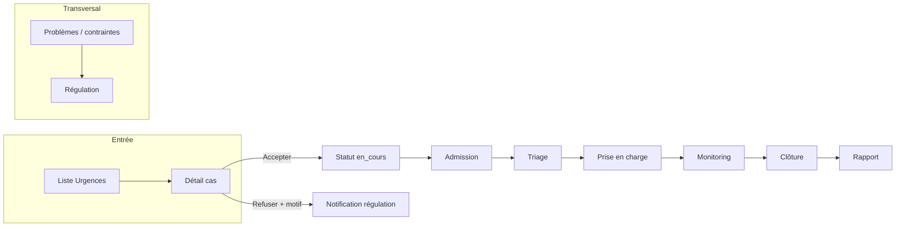

# Spécification produit & technique — Portail hôpital (dashboard + base de données)

> **Document** : cadrage pour **Lovable** (dashboard web + schéma Supabase + API).  
> **Source** : analyse du dépôt mobile **Étoile Bleue Urgentiste** (React Native / Expo).  
> **Version** : 1.0 — avril 2026  
> **Sortie attendue de Lovable** : un fichier Markdown d’intégration (API, tables, RLS, webhooks, événements Realtime) réutilisable par l’équipe mobile.

---

## 1. Objectif

Permettre au personnel hospitalier (rôle applicatif **`hopital`**) de :

1. Voir les **urgences orientées vers leur structure** (liées aux **dispatches** / **incidents** du système existant).
2. Suivre le **parcours patient** de l’annonce jusqu’à la **clôture** (admission → triage → prise en charge → monitoring → sortie / transfert).
3. **Communiquer** avec l’équipe mobile (téléphone / SMS prévus côté UI).
4. **Signaler** des contraintes (lits, personnel, équipement, médicaments) vers la **régulation**.
5. Consulter l’**historique** et les **rapports** de fin de prise en charge.

Le mobile **implémente déjà les écrans et la navigation** ; les **données sont aujourd’hui mockées** (tableau `MOCK_CASES`). Lovable doit fournir le **backend aligné** sur ce flux et sur les tables **Supabase** déjà documentées dans le projet (`MOBILE_INTEGRATION_GUIDE`, `STRUCTURE_ASSIGNMENT_MOBILE_GUIDE`).

---

## 2. Contexte mobile (référence)

| Élément | Détail |
|--------|--------|
| Stack | React Native, `@react-navigation`, Supabase JS (`EXPO_PUBLIC_SUPABASE_*`) |
| Entrée | `RoleSelection` → `Login` (identifiant 6 chiffres + PIN 6 chiffres) |
| Auth | Edge Function **`agent-login`** → session JWT ; profil dans **`users_directory`** |
| Routage | Si `users_directory.role === 'hopital'` → onglets **Hospital** ; sinon onglets **Urgentiste** |
| Validation portail | Après login, le mobile vérifie que le rôle correspond au portail choisi (urgentiste ≠ hôpital) |

**Fichiers clés (mobile)** :

- `App.tsx` — stack globale + écrans `Hospital*` enregistrés dans le même `Stack` que l’urgentiste.
- `src/navigation/HospitalTabs.tsx` — barre d’onglets hôpital.
- `src/screens/hospital/HospitalDashboardTab.tsx` — modèle **`EmergencyCase`**, **`MOCK_CASES`**, filtres, navigation.
- `src/contexts/AuthContext.tsx` — `UserProfile`, `validatePortalRole`, `signOut`.

---

## 3. Architecture de navigation (mobile)

### 3.1 Onglets (`HospitalTabs`)

| Onglet | Écran | Rôle UX |
|--------|--------|---------|
| **Urgences** | `HospitalDashboardTab` | Liste des cas + compteurs (vitaux / actifs) |
| **Admissions** | `HospitalAdmissionsListScreen` | Patients présents ou en parcours (recherche) |
| **Plus** | `HospitalSettingsScreen` | Raccourcis (historique, stats placeholder, déconnexion) |
| **Profil** | `HospitalProfileTab` | Infos compte (`users_directory`) + verrouillage appareil |

### 3.2 Stack (hors onglets, défini dans `App.tsx`)

Les écrans suivants reçoivent en général **`route.params.caseData`** de type **`EmergencyCase`** :

| Route | Composant | Fonction |
|-------|-----------|----------|
| `HospitalCaseDetail` | `HospitalCaseDetailScreen` | Détail cas, **accepter** (swipe) / **refuser** (motifs), carte / suivi ambulance mock, appel/SMS urgentiste |
| `HospitalAdmission` | `HospitalAdmissionScreen` | Assistant admission : mode d’arrivée, état, service |
| `HospitalTriage` | `HospitalTriageScreen` | Triage START (rouge/orange/jaune/vert), constantes, symptômes, diagnostic provisoire |
| `HospitalPriseEnCharge` | `HospitalPriseEnChargeScreen` | Prise en charge : onglets PC / examens / timeline (données locales mock) |
| `HospitalMonitoring` | `HospitalMonitoringScreen` | État patient, transfert, notes → enchaîne vers clôture |
| `HospitalClosure` | `HospitalClosureScreen` | Clôture → vers rapport |
| `HospitalReport` | `HospitalReportScreen` | Rapport synthétique + envoi (mock) |
| `HospitalHistory` | `HospitalHistoryScreen` | Historique (mock) → ouverture rapport |
| `HospitalIssues` | `HospitalIssuesScreen` | Signalement contraintes (mock) |
| `HospitalUrgencyDetail` | `HospitalUrgencyDetailScreen` | Vue alternative « timeline SOS » (peut être fusionnée avec le détail incident côté produit) |

**Chemins de navigation typiques** :

- Dashboard → `HospitalCaseDetail` (`caseData`).
- Détail → `HospitalAdmission` (bouton admission).
- Liste Admissions : selon `status` → `HospitalCaseDetail` | `HospitalTriage` | `HospitalPriseEnCharge`.

---

## 4. Modèle métier cible : `EmergencyCase` (contrat mobile)

Le type suivant est défini dans `HospitalDashboardTab.tsx` et sert de **contrat de données** pour Lovable (à mapper vers des tables / vues).

### 4.1 Identité & urgence

| Champ | Type | Description |
|-------|------|----------------|
| `id` | `string` | Identifiant affiché (ex. `URG-2026-006`) — à relier à **`incident_id`** / référence métier |
| `victimName` | `string` | Nom patient |
| `age` | `number` | Âge |
| `sex` | `"M" \| "F" \| "Inconnu"` | Sexe |
| `description` | `string` | Motif / description clinique |
| `level` | `critique \| urgent \| stable` | Gravité affichée |
| `typeUrgence` | `string` | Libellé catégorie (ex. Obstétrique, Traumatisme) |
| `address` | `string` | Adresse / lieu |
| `timestamp` | `string` | Heure affichée (liste) |
| `eta` | `string` | Texte « arrivée estimée » (ex. `5 min`) |

### 4.2 Mobile / régulation

| Champ | Type | Description |
|-------|------|-------------|
| `urgentisteName` | `string` | Nom médecin / équipe terrain |
| `urgentistePhone` | `string` | Téléphone (tel: / sms:) |

### 4.3 Statut parcours hôpital (`CaseStatus`)

Valeurs utilisées dans l’UI :

`en_attente` | `en_cours` | `admis` | `triage` | `prise_en_charge` | `termine`

**Interprétation UX actuelle** :

- `en_attente` : cas signalé, pas encore accepté par l’hôpital.
- `en_cours` : accepté / ambulance en route (vue « suivi » dans le détail).
- `admis`, `triage`, `prise_en_charge` : phases du parcours interne.
- `termine` : clôturé (hors filtres « alertes » par défaut).

### 4.4 Admission

| Champ | Type |
|-------|------|
| `arrivalTime` | `string` (optionnel) |
| `arrivalMode` | `ambulance` \| `transport_prive` \| `""` |
| `arrivalState` | `stable` \| `critique` \| `inconscient` \| `""` |
| `admissionService` | `urgence_generale` \| `trauma` \| `pediatrie` \| `""` |

### 4.5 Triage

| Champ | Type |
|-------|------|
| `triageLevel` | `rouge` \| `orange` \| `jaune` \| `vert` \| `""` |
| `vitals` | `{ tension, heartRate, temperature, satO2 }` (strings) |
| `symptoms` | `string` |
| `provisionalDiagnosis` | `string` |

### 4.6 Prise en charge & clôture

| Champ | Type |
|-------|------|
| `interventions` | liste `{ id, type: acte_medical\|examen\|traitement\|intervenant, category, detail, time, by? }` |
| `outcome` | ex. `hospitalise` \| `sorti` \| `decede` |
| `finalDiagnosis` | `string` |
| `closureTime` | `string` |

---

## 5. Flux fonctionnel (synthèse)

---

## 6. Lien avec le système existant (assignation structure)

Le guide **`STRUCTURE_ASSIGNMENT_MOBILE_GUIDE.md`** décrit déjà :

- Colonnes **`dispatches.assigned_structure_*`** (id, nom, lat, lng, téléphone, adresse, type).
- Mise à jour **`incidents.recommended_facility`** (nom) pour le citoyen.

**Attendu pour le portail hôpital** :

- Un hôpital ne doit voir les dossiers que si le **dispatch** (ou l’**incident**) est **orienté vers sa structure**, c.-à-d. `assigned_structure_id` = `health_structures.id` du compte hôpital (ou règle équivalente décidée en base).
- Temps réel : **`UPDATE` sur `dispatches`** (et éventuellement **`incidents`**) pour rafraîchir la liste sans polling agressif.

**Recommandation produit** : lier explicitement le compte **`users_directory`** (rôle `hopital`) à une ligne **`health_structures`** (ex. colonne `health_structure_id` ou table de liaison), pour filtrer les données côté RLS.

---

## 7. État actuel côté mobile (à combler côté backend)

| Fonctionnalité | État mobile | Besoin Lovable |
|----------------|-------------|------------------|
| Liste urgences | `MOCK_CASES` | Requête filtrée par structure + statuts |
| Accepter / refuser | État local + alerte | Persistance + notification unité / opérateur |
| Admission / triage / PEC | Formulaires | Tables ou JSON structuré + horodatage |
| Suivi ambulance | Position mock | Optionnel : position unité (`units` / tracking existant) |
| Problèmes service | Mock | Table `hospital_constraints` ou `signalements` typés |
| Rapport final | Mock | Document stocké + lien `incident_id` / `dispatch_id` |
| Historique | Mock | Requêtes sur dossiers clos |
| Notifications cloche | UI seulement | `notifications` ou Realtime + push FCM si prévu |

---

## 8. Exigences pour le dashboard opérateur (Lovable)

À minima, le dashboard web devrait permettre de :

1. **Assigner une structure** à une intervention (déjà couvert par `STRUCTURE_ASSIGNMENT_MOBILE_GUIDE` si implémenté).
2. Voir le **statut côté hôpital** (accepté / refusé / en cours / clos) si ces transitions sont persistées.
3. Recevoir les **refus** avec **motif** (liste dans `HospitalCaseDetailScreen` : indisponibilité lits, spécialiste, plateau technique, bloc, maintenance, autre).
4. Recevoir les **signalements de contraintes** (types : lits, personnel, équipement, médicaments + commentaire).
5. **Configurer** les structures dans **`health_structures`** (lits, spécialités, contact) pour cohérence avec l’app hôpital.

---

## 9. Exigences base de données & sécurité (Lovable)

1. **RLS** : les utilisateurs `hopital` ne lisent/écrivent que les lignes liées à **leur** `health_structure` (ou équivalent).
2. **Audit** : horodatage et `updated_by` sur les transitions de statut.
3. **Realtime** : publication sur les tables lues par le mobile (`dispatches`, éventuellement une table `hospital_case` dédiée).
4. **Cohérence** avec **`users_directory`** (profil, `auth_user_id`, `role = 'hopital'`).
5. Décider si le parcours hôpital est :
   - **A)** des colonnes / JSON sur `incidents` ou `dispatches`, ou  
   - **B)** une table dédiée **`hospital_encounters`** (ou nommage équivalent) avec FK vers `incident_id`, `dispatch_id`, `health_structure_id`.

---

## 10. Livrables attendus de Lovable (pour le prochain MD d’intégration)

Merci de retourner un **Markdown** structuré pour l’équipe mobile, contenant notamment :

1. **Schéma** : tables/colonnes finales, FK, index.
2. **RLS** : politiques par rôle (`hopital`, `service_role`, opérateur).
3. **API** : endpoints ou usage PostgREST (filtres, `select`, ordre).
4. **Realtime** : canaux, filtres `eq`, événements à écouter.
5. **Mapping** : tableau **champ DB** → champ **`EmergencyCase`** (section 4).
6. **Flux** : ordre des mises à jour (ex. refus hôpital → notification / statut dispatch).
7. **Variables / secrets** : ce qui doit figurer dans l’app (aucune clé service côté mobile).
8. **Points d’attention** : migrations, rétrocompatibilité, jeux de données de test.

---

## 11. Contacts techniques (références internes projet)

- Authentification agent : Edge Function **`agent-login`**, table **`users_directory`**.
- Structures sanitaires : **`health_structures`**.
- Interventions : **`incidents`**, **`dispatches`** (dont **`assigned_structure_*`**).
- Guide assignation : **`STRUCTURE_ASSIGNMENT_MOBILE_GUIDE.md`**.

---

*Fin du document de spécification pour Lovable.*
