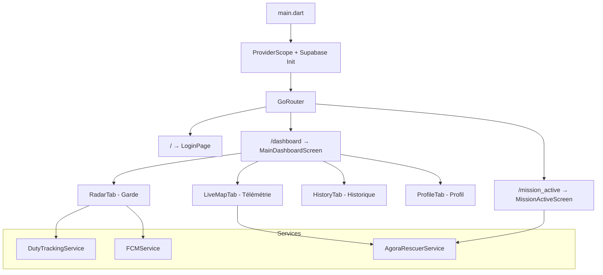

# 🔬 Analyse Complète — Étoile Bleue Urgentiste (eb-urgentiste)

> **Date** : 31 mars 2026  
> **Projet** : Application mobile Flutter pour secouristes/urgentistes  
> **Objectif** : Revue de code, identification des problèmes, et plan d'améliorations

---

## Table des matières

1. [Vue d'ensemble du projet](#1-vue-densemble-du-projet)
2. [Architecture actuelle](#2-architecture-actuelle)
3. [Analyse du MOBILE_INTEGRATION_GUIDE](#3-analyse-du-mobile_integration_guide)
4. [Problèmes critiques 🔴](#4-problèmes-critiques-)
5. [Problèmes majeurs 🟠](#5-problèmes-majeurs-)
6. [Problèmes mineurs 🟡](#6-problèmes-mineurs-)
7. [Écarts Code ↔ Guide d'intégration](#7-écarts-code--guide-dintégration)
8. [Plan d'amélioration](#8-plan-damélioration)
9. [Checklist des tâches](#9-checklist-des-tâches)

---

## 1. Vue d'ensemble du projet

| Élément | Détail |
|---|---|
| **Nom** | `etoile_bleu_rescuer` |
| **Framework** | Flutter (Dart SDK ^3.11.3) |
| **State Management** | Riverpod |
| **Navigation** | GoRouter |
| **Backend** | Supabase (PostgreSQL + Auth + Realtime + Edge Functions) |
| **Maps** | Google Maps Flutter (⚠️ Le guide recommande Mapbox) |
| **VoIP** | Agora RTC Engine 6.5.3 |
| **Push** | Flutter CallKit Incoming (FCM non configuré) |
| **Firebase** | Projet `etoilebleu-2026` (config référencée mais non utilisée) |

### Fichiers du projet (14 fichiers Dart)

```
lib/
├── main.dart                                          (58 lignes)
├── core/
│   ├── router/
│   │   ├── app_router.dart                            (56 lignes)
│   │   └── navigator_key.dart                         (5 lignes)
│   ├── services/
│   │   ├── agora_rescuer_service.dart                 (71 lignes)
│   │   ├── duty_tracking_service.dart                 (95 lignes)
│   │   └── fcm_service.dart                           (119 lignes)
│   ├── theme/
│   │   └── app_theme.dart                             (43 lignes)
│   └── widgets/
│       └── swipe_to_accept.dart                       (93 lignes)
├── features/
│   ├── auth/presentation/
│   │   └── login_page.dart                            (415 lignes)
│   ├── calls/presentation/
│   │   └── mission_active_screen.dart                 (533 lignes)
│   └── dashboard/presentation/
│       ├── main_dashboard_screen.dart                 (73 lignes)
│       ├── live_map_tab.dart                          (896 lignes)
│       ├── radar_tab.dart                             (84 lignes)
│       ├── profile_tab.dart                           (51 lignes)
│       └── history_tab.dart                           (21 lignes)
```

> **Total** : ~2 614 lignes de code Dart

---

## 2. Architecture actuelle

### Diagramme de l'architecture



### Points forts ✅

- **Architecture feature-based** structurée (auth, calls, dashboard)
- **Riverpod** pour le state management (choix solide)
- **GoRouter** avec refresh automatique sur AuthStateChange
- **DutyTrackingService** avec optimisation batterie (distanceFilter: 20m)
- **LiveMapTab** avec radar pulse animé bien conçu (frames pré-générées)
- **Supabase Realtime** partiellement implémenté (operator_calls, dispatches)
- **SwipeToAccept** widget réutilisable avec UX professionnelle
- **MissionActiveScreen** avec auto-détection d'arrivée (<50m)

### Points faibles ❌

- **Pas de couche data/domain** : logique métier mélangée dans les UI
- **Pas de modèles Dart** : tout est `Map<String, dynamic>` brut
- **Pas de gestion d'erreurs** centralisée
- **Code Firebase hérité** commenté partout (migration incomplète)
- **Pas de tests**
- **Fichier monstre** : `live_map_tab.dart` (896 lignes)

---

## 3. Analyse du MOBILE_INTEGRATION_GUIDE

Le guide est **complet et bien structuré** (1 357 lignes) couvrant:

| Section | Complétude | Qualité |
|---|---|---|
| Schéma DB (17 tables) | ✅ Excellent | Tables bien documentées avec types et defaults |
| Système de rôles (7 rôles) | ✅ Excellent | Matrice d'accès claire |
| Auth (OTP + Email/Password) | ✅ Complet | Flux bien détaillé |
| Edge Functions (7 fonctions) | ✅ Complet | Params et réponses documentés |
| Agora RTC | ✅ Complet | Flux SOS et sortant avec diagrammes |
| Realtime (10 tables) | ✅ Complet | Exemples Dart fournis |
| GPS Temps réel | ✅ Complet | Secouriste + Citoyen couverts |
| Maps | ⚠️ Mapbox | Guide dit Mapbox, code utilise Google Maps |
| Storage | ✅ Complet | Avatars + Incidents |
| Push FCM | ✅ Complet | Data messages + Flutter handler |
| Messagerie | ✅ Complet | Texte + Audio |
| Signalements | ✅ Complet | Avec médias |

> [!IMPORTANT]
> Le guide est la **source de vérité** pour l'intégration. Le code actuel est significativement en retard par rapport à ce que le guide spécifie.

---

## 4. Problèmes critiques 🔴

### 🔴 C1. Clés et secrets exposés dans le code

**Fichiers concernés** : [agora_rescuer_service.dart](file:///c:/Users/Emmanuel%20kilemo/Documents/eb-urgentiste/lib/core/services/agora_rescuer_service.dart#L9), [.env](file:///c:/Users/Emmanuel%20kilemo/Documents/eb-urgentiste/.env)

```diff
- final String _appId = "0c117d3b01a64fd8898b9e6e580a6534"; // HARDCODÉ !
+ final String _appId = dotenv.env['AGORA_APP_ID'] ?? '';
```

| Problème | Localisation | Risque |
|---|---|---|
| Agora App ID hardcodé dans le service | `agora_rescuer_service.dart:9` | Fuite de clé API |
| `.env` commité (pas dans `.gitignore`) | `.gitignore` | Secrets exposés sur Git |
| Clés Supabase et Mapbox en clair dans le guide | `MOBILE_INTEGRATION_GUIDE.md` | Exposition publique |

### 🔴 C2. Incohérence des URLs Supabase

Le `.env` pointe vers un projet **différent** de celui du guide :

| Source | URL Supabase |
|---|---|
| `.env` | `https://qwzpeqvkgodmapegysvj.supabase.co` |
| Guide | `https://npucuhlvoalcbwdfedae.supabase.co` |
| Compte Supabase connecté | Projets `oviawnlybqlduwhugqvl` (LauNetwork) et `erfrzgjtkwufpjuxorxy` (Rek) |

> [!CAUTION]
> **Aucun des 3 ne correspond !** Le projet Étoile Bleue n'existe pas dans le compte Supabase actuellement connecté. Cela signifie que l'app ne peut pas fonctionner en l'état.

### 🔴 C3. Authentification — Auto-inscription non sécurisée

**Fichier** : [login_page.dart](file:///c:/Users/Emmanuel%20kilemo/Documents/eb-urgentiste/lib/features/auth/presentation/login_page.dart#L96-L162)

Le flux de login actuel est **dangereux** :
1. Si `signInWithPassword` échoue → **tente automatiquement un `signUp`**
2. N'importe qui peut créer un compte secouriste en tapant un identifiant et un PIN
3. Écrit dans une table `rescuers` (qui **n'existe pas** dans le schéma du guide)
4. Le guide spécifie que les comptes secouristes doivent être **créés par un admin**

```dart
// DANGEREUX : auto-création incontrôlée
final authResponse = await Supabase.instance.client.auth.signUp(
  email: emailToLogin,
  password: _pin,
);
```

### 🔴 C4. Agora rejoint le canal sans token

**Fichier** : [agora_rescuer_service.dart](file:///c:/Users/Emmanuel%20kilemo/Documents/eb-urgentiste/lib/core/services/agora_rescuer_service.dart#L46-L56)

```dart
await _engine.joinChannel(
  token: '', // ← VIDE ! Pas de sécurité d'accès au canal
  channelId: channelId,
  uid: 0,
  ...
);
```

Le guide spécifie clairement de **générer un token** via l'Edge Function `agora-token`. Sans token, n'importe qui peut écouter les canaux.

### 🔴 C5. Table `rescuers` inexistante dans le schéma

Le code référence une table `rescuers` dans plusieurs endroits :
- [login_page.dart:66](file:///c:/Users/Emmanuel%20kilemo/Documents/eb-urgentiste/lib/features/auth/presentation/login_page.dart#L66) — `from('rescuers').select()`
- [login_page.dart:126](file:///c:/Users/Emmanuel%20kilemo/Documents/eb-urgentiste/lib/features/auth/presentation/login_page.dart#L126) — `from('rescuers').insert()`
- [live_map_tab.dart:334](file:///c:/Users/Emmanuel%20kilemo/Documents/eb-urgentiste/lib/features/dashboard/presentation/live_map_tab.dart#L334) — `from('rescuers').stream`

**Cette table n'existe pas dans le guide.** La table correcte est `users_directory` avec `role = 'secouriste'`.

### 🔴 C6. Table `calls` inexistante dans le schéma

Le code référence `calls` dans :
- [live_map_tab.dart:303](file:///c:/Users/Emmanuel%20kilemo/Documents/eb-urgentiste/lib/features/dashboard/presentation/live_map_tab.dart#L303) — `from('calls').select()`
- [mission_active_screen.dart:159-163](file:///c:/Users/Emmanuel%20kilemo/Documents/eb-urgentiste/lib/features/calls/presentation/mission_active_screen.dart#L159-L163) — `from('calls').update()`

**La table correcte est `call_history`** selon le guide.

---

## 5. Problèmes majeurs 🟠

### 🟠 M1. FCMService entièrement non implémenté

**Fichier** : [fcm_service.dart](file:///c:/Users/Emmanuel%20kilemo/Documents/eb-urgentiste/lib/core/services/fcm_service.dart)

- Tout le code de push background est **commenté** (lignes 8-58)
- `_saveTokenRefresh` est **commenté** (lignes 113-117)
- Firebase Messaging n'est **pas initialisé** (`firebase_messaging` n'est même pas dans `pubspec.yaml`)
- Le token FCM n'est **jamais enregistré** dans `users_directory.fcm_token`

### 🟠 M2. Realtime partiellement implémenté

| Listener | Statut | Fichier |
|---|---|---|
| `operator_calls` (INSERT) | ✅ Implémenté | `live_map_tab.dart:383-407` |
| `dispatches` (INSERT) | ✅ Implémenté | `live_map_tab.dart:466-489` |
| `call_history` (INSERT) | ❌ Non implémenté | — |
| `incidents` (INSERT/UPDATE) | ❌ Non implémenté (commenté) | `live_map_tab.dart:337-339` |
| `messages` (INSERT) | ❌ Non implémenté | — |
| `active_rescuers` (INSERT/UPDATE) | ❌ Non implémenté (commenté) | `live_map_tab.dart:332-335` |
| `units` (UPDATE) | ❌ Non implémenté | — |
| `notifications` (INSERT) | ❌ Non implémenté | — |

### 🟠 M3. DutyTrackingService utilise la mauvaise table

**Fichier** : [duty_tracking_service.dart](file:///c:/Users/Emmanuel%20kilemo/Documents/eb-urgentiste/lib/core/services/duty_tracking_service.dart#L42-L47)

```dart
// Code actuel : utilise 'units' avec user.id
await Supabase.instance.client.from('units').update({...}).eq('id', user.id);
```

**Problème** : `units.id` est un UUID **propre à l'unité**, pas le `auth.users.id`. Le guide distingue clairement :
- `active_rescuers` → position GPS du secouriste (clé = `user_id`)
- `units` → position de l'unité/véhicule (clé = `units.id`)

Le service devrait d'abord **upsert dans `active_rescuers`** et optionnellement mettre à jour `units` via `assigned_unit_id`.

### 🟠 M4. Heartbeat non implémenté

Le guide spécifie un heartbeat toutes les **30 secondes** pour maintenir `users_directory.last_seen_at`. **Aucun code ne fait ça.**

### 🟠 M5. Google Maps vs Mapbox

Le code utilise `google_maps_flutter` tandis que le guide spécifie **Mapbox** (`mapbox_maps_flutter`). 

| Aspect | Google Maps (actuel) | Mapbox (guide) |
|---|---|---|
| Dépendance | `google_maps_flutter: ^2.16.0` | `mapbox_maps_flutter: ^2.x` |
| Thème sombre | Style JSON personnalisé (bien fait) | `MapboxStyles.DARK` |
| Token | Clé API Google (non visible dans le code) | Token dans le guide |
| Coût | Payant après 28k chargements/mois | Gratuit jusqu'à 50k |

### 🟠 M6. Historique non implémenté

**Fichier** : [history_tab.dart](file:///c:/Users/Emmanuel%20kilemo/Documents/eb-urgentiste/lib/features/dashboard/presentation/history_tab.dart)

Juste un placeholder avec "Bientôt". Devrait afficher l'historique des missions depuis `dispatches` et `incidents`.

### 🟠 M7. Profil minimaliste

**Fichier** : [profile_tab.dart](file:///c:/Users/Emmanuel%20kilemo/Documents/eb-urgentiste/lib/features/dashboard/presentation/profile_tab.dart)

- Affiche uniquement l'email
- Ne charge **aucune donnée** de `users_directory`
- Pas d'avatar, prénom, nom, grade, matricule, zone, spécialisation
- Ne gère pas la déconnexion propre (pas de nettoyage `active_rescuers`, pas de mise à jour `status: 'offline'`)

### 🟠 M8. MissionActiveScreen — Références incohérentes

**Fichier** : [mission_active_screen.dart](file:///c:/Users/Emmanuel%20kilemo/Documents/eb-urgentiste/lib/features/calls/presentation/mission_active_screen.dart)

Problèmes identifiés :
- Utilise `Supabase.from(collectionName).stream(primaryKey: ['id'])` — correct pour Realtime mais **la table 'calls' n'existe pas**
- Le `_channelId` est utilisé comme **ID de document** dans les requêtes DB, mais c'est censé être un **nom de canal Agora** (ex: `SOS-abc12345-1711900000`)
- `_updateStatus` écrit dans `calls` ou `incidents` mais les statuts envoyés (`sur_place`, `medical`, `transport`) ne correspondent pas aux enums du guide (`in_progress`, `arrived`, etc.)

---

## 6. Problèmes mineurs 🟡

### 🟡 m1. Dépendance `dotenv` dupliquée

```yaml
# pubspec.yaml
flutter_dotenv: ^6.0.0   # Utilisé dans main.dart
dotenv: ^4.2.0            # Package différent, non utilisé → supprimer
```

### 🟡 m2. Code Firebase hérité

De nombreux blocs de code commentés font référence à `FirebaseFirestore`, `QueryDocumentSnapshot`, `doc.data()`, etc. Ces vestiges doivent être **nettoyés**.

- [live_map_tab.dart:46-49](file:///c:/Users/Emmanuel%20kilemo/Documents/eb-urgentiste/lib/features/dashboard/presentation/live_map_tab.dart#L46-L49) — StreamSubscriptions commentées
- [live_map_tab.dart:322-368](file:///c:/Users/Emmanuel%20kilemo/Documents/eb-urgentiste/lib/features/dashboard/presentation/live_map_tab.dart#L322-L368) — Listeners Firebase commentés
- [live_map_tab.dart:794-795](file:///c:/Users/Emmanuel%20kilemo/Documents/eb-urgentiste/lib/features/dashboard/presentation/live_map_tab.dart#L794-L795) — `doc.data() as Map` → ancien pattern Firestore

### 🟡 m3. `withOpacity()` deprecated

Flutter 3.10+ déprecie `Color.withOpacity()`. Utiliser `Color.withValues(alpha: x)` à la place. Présent dans **de nombreux fichiers**.

### 🟡 m4. Import inutilisé

- [live_map_tab.dart:2](file:///c:/Users/Emmanuel%20kilemo/Documents/eb-urgentiste/lib/features/dashboard/presentation/live_map_tab.dart#L2) — `dart:ui as ui` (utilisé pour blur)
- [mission_active_screen.dart:2](file:///c:/Users/Emmanuel%20kilemo/Documents/eb-urgentiste/lib/features/calls/presentation/mission_active_screen.dart#L2) — `dart:ui` importé mais non utilisé directement

### 🟡 m5. `_pendingCalls` utilise le pattern Firestore

[live_map_tab.dart:240-248](file:///c:/Users/Emmanuel%20kilemo/Documents/eb-urgentiste/lib/features/dashboard/presentation/live_map_tab.dart#L240-L248) :

```dart
// Ancien pattern Firebase : doc.data() as Map
final loc = (doc.data() as Map)['location'];
```

Ce code crashera avec les données Supabase (qui sont des `Map<String, dynamic>` directement, pas des `DocumentSnapshot`).

### 🟡 m6. Pas de gestion AppLifecycleState

L'app ne gère pas les transitions foreground/background pour :
- Mettre à jour `users_directory.status` → `'offline'` quand l'app passe en arrière-plan
- Reprendre le heartbeat et le GPS tracking au retour

### 🟡 m7. `CupertinoIcons` usage sans import

[live_map_tab.dart:422](file:///c:/Users/Emmanuel%20kilemo/Documents/eb-urgentiste/lib/features/dashboard/presentation/live_map_tab.dart#L422) utilise `CupertinoIcons.phone_fill` — dépendance `cupertino_icons` est présente dans pubspec mais l'import Cupertino n'est pas fait dans le fichier.

---

## 7. Écarts Code ↔ Guide d'intégration

### Tableau comparatif complet

| Fonctionnalité (Guide) | Implémenté ? | Écart |
|---|---|---|
| **Auth SMS OTP (Citoyens)** | ❌ Non concerné | App secouriste uniquement |
| **Auth Email/Password (Secouriste)** | ⚠️ Partiel | Utilise identifiant + PIN au lieu d'email/mot de passe. Auto-signup dangereux |
| **Vérif `must_change_password`** | ❌ | Non implémenté |
| **Heartbeat 30s** | ❌ | Non implémenté |
| **Déconnexion propre** | ⚠️ Partiel | Toggle duty off mais pas de cleanup `active_rescuers` ni `status: 'offline'` dans `users_directory` |
| **Edge Function agora-token** | ❌ | Token vide, pas de call à l'edge function |
| **Écouter `call_history`** | ❌ | Non implémenté |
| **Écouter `dispatches`** | ✅ | Implémenté avec Realtime |
| **Écouter `operator_calls`** | ✅ | Implémenté avec Realtime |
| **Écouter `messages`** | ❌ | Non implémenté |
| **Écouter `incidents`** | ❌ | Commenté |
| **GPS `active_rescuers` upsert** | ❌ | Écrit dans `units` au lieu de `active_rescuers` |
| **GPS citoyen (pendant SOS)** | ❌ Non concerné | Fonctionnalité citoyen |
| **Nettoyage `active_rescuers` à la déconnexion** | ❌ | Non implémenté |
| **Upload avatar (Storage)** | ❌ | Non implémenté |
| **Upload médias incident** | ❌ | Non implémenté |
| **Enregistrement token FCM** | ❌ | FCM non configuré |
| **Push notifications (background handler)** | ❌ | Commenté, non fonctionnel |
| **Messagerie opérationnelle** | ❌ | Aucun écran de messagerie |
| **Signalements** | ❌ | Non implémenté (pas dans le scope secouriste mais possible) |
| **Mise à jour position unité** | ⚠️ Partiel | Écrit dans `units` avec `auth.uid` au lieu de `units.id` |
| **Cycle de vie incidents (statuts)** | ⚠️ Partiel | Statuts non conformes aux enums du guide |
| **Mapbox** | ❌ | Utilise Google Maps |
| **CallKit/ConnectionService** | ⚠️ Shell | Code CallKit présent mais commenté |

---

## 8. Plan d'amélioration

### Phase 1 : 🔴 Fondations critiques (Priorité P0)

> **Objectif** : Rendre l'app fonctionnelle et sécurisée

| # | Tâche | Fichiers | Effort |
|---|---|---|---|
| 1.1 | **Résoudre l'incohérence Supabase** — Clarifier quel projet utiliser, mettre à jour `.env` | `.env` | 🟢 Petit |
| 1.2 | **Sécuriser les secrets** — Ajouter `.env` au `.gitignore`, retirer les clés hardcodées d'Agora | `.gitignore`, `agora_rescuer_service.dart` | 🟢 Petit |
| 1.3 | **Refondre l'authentification** — Utiliser `users_directory` au lieu de `rescuers`, supprimer l'auto-signup, implémenter email/password conforme au guide | `login_page.dart` | 🟡 Moyen |
| 1.4 | **Corriger les références de tables** — `rescuers` → `users_directory`, `calls` → `call_history` | Tous les fichiers | 🟡 Moyen |
| 1.5 | **Implémenter le token Agora** — Appeler l'Edge Function `agora-token` avant de rejoindre un canal | `agora_rescuer_service.dart` | 🟡 Moyen |
| 1.6 | **Supprimer la dépendance `dotenv` dupliquée** | `pubspec.yaml` | 🟢 Petit |

### Phase 2 : 🟠 Couche Data & Modèles (Priorité P1)

> **Objectif** : Structurer le code pour la maintenabilité

| # | Tâche | Fichiers | Effort |
|---|---|---|---|
| 2.1 | **Créer les modèles Dart** — `UserProfile`, `Incident`, `Dispatch`, `CallHistory`, `Unit`, `Message` | Nouveaux fichiers `lib/core/models/` | 🔴 Grand |
| 2.2 | **Créer une couche Repository** — Séparer les appels Supabase de l'UI | Nouveaux fichiers `lib/core/repositories/` | 🔴 Grand |
| 2.3 | **Créer des Providers Riverpod** pour les données | Nouveaux fichiers `lib/core/providers/` | 🟡 Moyen |
| 2.4 | **Nettoyer le code Firebase hérité** — Supprimer tous les blocs commentés | `live_map_tab.dart`, `fcm_service.dart` | 🟡 Moyen |

### Phase 3 : 🟠 Services essentiels (Priorité P1)

> **Objectif** : Implémenter les fonctionnalités manquantes critiques

| # | Tâche | Fichiers | Effort |
|---|---|---|---|
| 3.1 | **Implémenter le heartbeat** — Timer 30s pour `users_directory.last_seen_at` | Nouveau service ou dans `main.dart` | 🟢 Petit |
| 3.2 | **Corriger le GPS tracking** — Écrire dans `active_rescuers` (upsert) en plus de `units` | `duty_tracking_service.dart` | 🟡 Moyen |
| 3.3 | **Implémenter le FCM** — Firebase init, token registration, background handler | `fcm_service.dart`, `main.dart`, `pubspec.yaml` | 🔴 Grand |
| 3.4 | **Compléter les listeners Realtime** — `call_history`, `incidents`, `messages`, `active_rescuers` | `live_map_tab.dart` ou nouveau service | 🟡 Moyen |
| 3.5 | **Gestion du cycle de vie app** — AppLifecycleState pour online/offline | `main.dart` ou nouveau service | 🟡 Moyen |
| 3.6 | **Déconnexion propre** — Cleanup `active_rescuers`, `users_directory.status`, `units.status` | `profile_tab.dart`, `duty_tracking_service.dart` | 🟡 Moyen |

### Phase 4 : 🟡 Fonctionnalités utilisateur (Priorité P2)

> **Objectif** : Compléter l'expérience utilisateur

| # | Tâche | Fichiers | Effort |
|---|---|---|---|
| 4.1 | **Profil complet** — Charger `users_directory`, afficher avatar/prénom/nom/grade/matricule/zone, édition possible | `profile_tab.dart` | 🟡 Moyen |
| 4.2 | **Historique des missions** — Liste des `dispatches` + `incidents` passés du secouriste | `history_tab.dart` | 🟡 Moyen |
| 4.3 | **Messagerie opérationnelle** — Nouvel écran pour envoyer/recevoir messages texte et audio | Nouveau feature `lib/features/messaging/` | 🔴 Grand |
| 4.4 | **Notifications in-app** — Écouter `notifications` table, afficher un badge | Dashboard, nouveau widget | 🟡 Moyen |
| 4.5 | **Corriger les statuts du MissionActiveScreen** — Aligner sur les enums du guide | `mission_active_screen.dart` | 🟢 Petit |

### Phase 5 : 💎 Polish & Qualité (Priorité P3)

> **Objectif** : Préparer pour la production

| # | Tâche | Fichiers | Effort |
|---|---|---|---|
| 5.1 | **Refactorer `live_map_tab.dart`** — Extraire en sous-widgets et services | `live_map_tab.dart` → multiples fichiers | 🔴 Grand |
| 5.2 | **Décision Maps : Google vs Mapbox** — Trancher et uniformiser | Config natives + Dart | 🟡 Moyen |
| 5.3 | **Remplacer `withOpacity()`** par `withValues(alpha:)` partout | Tous les fichiers | 🟢 Petit |
| 5.4 | **Écrire des tests unitaires** pour les services et repositories | Nouveaux fichiers `test/` | 🔴 Grand |
| 5.5 | **Ajouter un splash screen** et vérification de version | `main.dart`, config natives | 🟡 Moyen |

---

## 9. Checklist des tâches

### Phase 1 — Fondations critiques 🔴
- [ ] 1.1 Résoudre l'incohérence Supabase URL
- [ ] 1.2 Sécuriser les secrets (`.gitignore` + retirer hardcoded)
- [ ] 1.3 Refondre l'authentification (conformer au guide)
- [ ] 1.4 Corriger les noms de tables (`rescuers` → `users_directory`, `calls` → `call_history`)
- [ ] 1.5 Implémenter le token Agora via Edge Function
- [ ] 1.6 Supprimer la dépendance `dotenv` dupliquée

### Phase 2 — Couche Data 🟠
- [ ] 2.1 Créer les modèles Dart
- [ ] 2.2 Créer la couche Repository
- [ ] 2.3 Créer les Providers Riverpod pour les données
- [ ] 2.4 Nettoyer le code Firebase hérité

### Phase 3 — Services essentiels 🟠
- [ ] 3.1 Implémenter le heartbeat (30s)
- [ ] 3.2 Corriger le GPS tracking (`active_rescuers`)
- [ ] 3.3 Implémenter Firebase Messaging (FCM)
- [ ] 3.4 Compléter les listeners Realtime
- [ ] 3.5 Gestion du cycle de vie app (AppLifecycleState)
- [ ] 3.6 Déconnexion propre (cleanup toutes les tables)

### Phase 4 — Fonctionnalités 🟡
- [ ] 4.1 Profil complet avec données `users_directory`
- [ ] 4.2 Historique des missions
- [ ] 4.3 Messagerie opérationnelle
- [ ] 4.4 Notifications in-app
- [ ] 4.5 Corriger les statuts de mission (enums guide)

### Phase 5 — Polish 💎
- [ ] 5.1 Refactorer `live_map_tab.dart` (896 lignes)
- [ ] 5.2 Trancher Google Maps vs Mapbox
- [ ] 5.3 Remplacer `withOpacity()` deprecated
- [ ] 5.4 Écrire des tests unitaires
- [ ] 5.5 Ajouter splash screen + version check

---

> [!NOTE]
> Ce document servira de **roadmap** pour les prochaines sessions de développement. Chaque tâche sera cochée au fur et à mesure de l'avancement. Les phases sont ordonnées par priorité : commencer impérativement par la Phase 1 avant de passer aux suivantes.

---

*Analyse générée le 31 mars 2026 — Projet Étoile Bleue Urgentiste*
